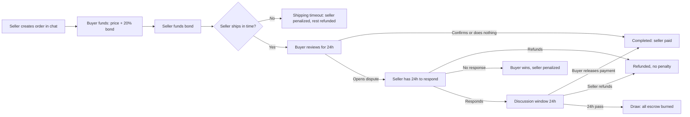
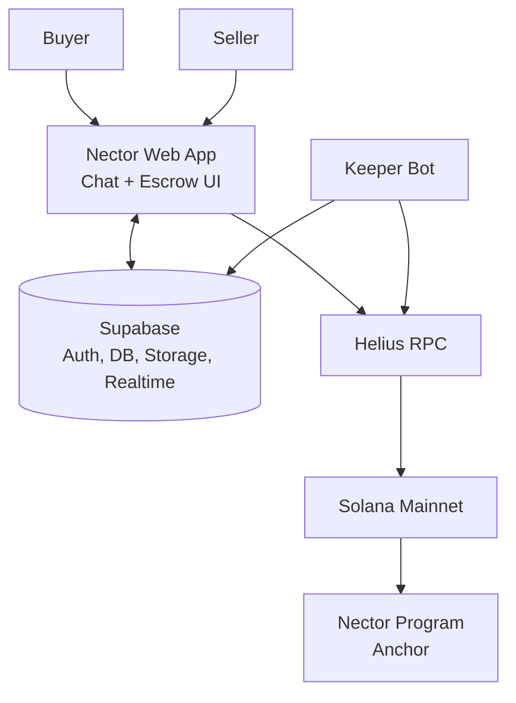

# Nector

**Chat-native, non-custodial escrow on Solana. Safe trades between strangers, as easy as sending a message.**

Built for the **Colosseum Crypto World's Fair Hackathon**.

| | |
| --- | --- |
| Live app | nector.chat |
| Demo video | https://youtu.be/s3RhI91u9hs |
| Program (Solana Mainnet) | [`WytegETAnkDtkeo5H63QvnRPKgK39ez5MSqSBqwydPb`](https://explorer.solana.com/address/WytegETAnkDtkeo5H63QvnRPKgK39ez5MSqSBqwydPb) |
| Deploy transaction | [View on Explorer](https://explorer.solana.com/tx/35rU9AjJcvBg68WVYhQhZnzJAAy3j7N5RwCX1BHVWfsBKDT7ZcdK4ygxXuumjCnq8Xg4eDtHiSXeENVFg8WmvFp1) |

---

## What is Nector?

Nector is an escrow platform where two people can agree on a deal in a chat and lock the payment in a Solana smart contract, without a middleman.

A buyer and a seller negotiate in a conversation, the seller creates an escrow order **inside that conversation**, and the contract holds the money until the deal is done. If something goes wrong, the contract decides the outcome from deadlines and bonds. There is no admin, no moderator and no KYC.

Nector supports **physical products, digital products and NFTs**.

The user actions are deliberately simple: **create order, fund escrow, ship, confirm delivery.**

## The problem

Buyers fear paying and never receiving the item. Sellers fear shipping and never getting paid. Escrow solves this in theory, but it is rarely used in practice because existing services:

- have complex interfaces and jargon that ordinary users don't understand,
- require KYC, which adds friction,
- depend on a central administrator to settle disputes manually,
- resolve disputes slowly.

So many small sellers and online buyers skip escrow entirely, and scams continue. The problem isn't escrow technology. It is **accessibility and usability**.

## What makes Nector different

- **Chat-native.** The order is created and managed inside the conversation. No switching apps, no separate forms.
- **No admin dispute resolution.** Disputes are settled by contract rules, deadlines and bonds, not by a human moderator.
- **Non-custodial.** Funds sit in program-derived accounts (PDAs). In the deployed code there is no function that lets an operator release or redirect escrow funds.
- **Every delay has a cost.** Each phase has a deadline, and missing it triggers an automatic outcome.
- **Made for non-crypto users.** The interface hides contract details and shows plain choices and a clear cost breakdown before anyone commits money.

---

## How it works



### 1. Create the order

The seller sets:

- product type (physical or digital), name, description and images
- price in USD (shown in USD, settled in SOL)
- shipping window: up to **30 days** for physical, up to **48 hours** for digital
- the **draw-dispute mode**, BTR or STR (explained below)

Before funding, the buyer sees the total to pay, both bonds, the fee and what happens in a draw.

### 2. Fund the escrow

Both sides put money in. Each bond is a deposit that is returned on a normal outcome.

| Mode | Buyer deposits | Seller deposits | If a dispute ends in a draw |
| --- | --- | --- | --- |
| **BTR** (Buyer Take Risk) | price + 20% bond | 20% of price | Buyer is exposed to the larger loss |
| **STR** (Seller Take Risk) | price + 20% bond | 120% of price | Seller is exposed to the larger loss |

Digital products always use BTR. If the seller never funds, the buyer can cancel and get their escrowed funds back.

### 3. Ship or deliver

- **Physical:** the seller marks the item as shipped before the deadline. No proof is needed at this stage; the system relies on incentives.
- **Digital:** the seller uploads the file. The buyer can access it before confirming.

If the seller misses the deadline, they lose **20% of the product price** from their bond (half goes to the buyer, half is burned) and everything else is refunded.

### 4. Review (24 hours)

The buyer confirms the order, or opens a dispute if the item wasn't received or isn't as described. If the buyer does nothing for 24 hours, payment is released to the seller automatically.

### 5. Disputes

A dispute can only be opened by the buyer, and each order has one. The seller then has 24 hours to:

- **Refund:** everyone gets their money back, no penalty.
- **Respond:** both sides enter a 24-hour discussion window. The buyer can release payment, or the seller can refund.
- **Do nothing:** the buyer wins and the seller loses 20% of the price (half to the buyer, half burned).

### 6. Draw

If the discussion window ends with no action, the result is a **draw and all funds in escrow are burned**. Both sides lose. This makes stalling and bad-faith disputes irrational, because the only way to keep your money is to resolve the issue.

### Outcomes at a glance

| Outcome | What happens |
| --- | --- |
| **Complete** (buyer confirms, or review timeout) | Seller gets the price and their bond back; buyer gets their bond back |
| **Refund** (seller refunds) | Buyer gets price and bond back; seller gets bond back; no penalty |
| **Buyer wins / shipping timeout** | Seller pays a 20% penalty (half to buyer, half burned); the rest is returned |
| **Draw** | All escrow is burned |

### Timeouts

| Timeout | Who must act | Deadline | If they don't |
| --- | --- | --- | --- |
| Shipping | Seller | the chosen shipping window | Seller penalized, buyer refunded |
| Review | Buyer | 24 hours | Seller is paid |
| Response | Seller | 24 hours | Buyer wins |
| Discussion | Both | 24 hours | Draw |

Smart contracts can't run on a schedule, so an outside transaction has to trigger a timeout. Nector runs a **Keeper Bot** that watches orders and submits them, but the **contract itself checks the deadline**, rejects early calls, and **lets anyone submit a timeout**. The Keeper provides liveness, not authority.

### Fees

**1% of the price, paid by each side when it funds** (2% in total for an escrow order, not refunded on cancellation). NFT sales charge 1% from the seller's proceeds.

### NFT sales

Sellers can list an NFT into an on-chain vault, and a buyer purchases it in a single atomic swap. A seller can cancel to get the NFT back, and the same NFT can be listed again immediately. Supports classic SPL / Token-2022 NFTs and Metaplex Core assets.

---

## Architecture



The core principle:

> **The app manages the experience and off-chain data. The Solana program enforces financial state and transaction rules.**

| Layer | Role |
| --- | --- |
| **Solana program (Anchor)** | Escrow custody, state machine, deadlines, disputes, penalties, NFT swaps |
| **Web app** | Chat, order creation, Phantom wallet signing |
| **Supabase** | Profiles, contacts, messages, order metadata, file storage, realtime updates |
| **Keeper Bot** | Submits timeout transactions and syncs the resulting status to the app |

Full details: [docs/architecture.md](docs/architecture.md) and [docs/smart-contract.md](docs/smart-contract.md).

## Security and trust

Nector doesn't try to prove real-world events like whether a parcel arrived. It enforces **state rules, deadlines and economic penalties**, so cheating costs more than it gains.

What the design gives you:

- strict per-instruction state checks, so phases can't be skipped
- role checks and PDA seed constraints on every payout
- checked arithmetic and an escrow-balance check before every payout
- fixed fee and burn addresses, so a caller can't substitute a recipient
- permissionless timeouts, so settlement doesn't depend on one operator

Honest limitations of the current release:

- **The contract has not been audited.** Use only funds you can afford to lose.
- **The program is upgradeable and the upgrade authority is held by a single wallet.** The deployed code has no admin function for escrow funds, but the holder of that key could deploy new code. See [docs/security.md](docs/security.md).
- Dispute-opening and dispute-response calls don't check their own deadline, so a late call can succeed until someone submits the matching timeout.
- Off-chain order data in Supabase can be edited by order participants, so it is display data only. The on-chain state is the source of truth.

The full threat model is in [docs/security.md](docs/security.md).

---

## Tech stack

- **Blockchain:** Solana Mainnet, Anchor 0.32.1 (Rust), SPL Token / Token-2022, Metaplex Core
- **Frontend:** React and TypeScript, Phantom wallet
- **Backend services:** Supabase (Auth, Postgres with Row Level Security, Storage, Realtime)
- **Infrastructure:** Helius RPC and DAS API, Metaplex Umi
- **Automation:** TypeScript Keeper Bot using `@coral-xyz/anchor`
- **Pricing display:** CoinGecko (display only; the contract never uses prices)

## Repository structure

```text
nector-cwf/
├── README.md
├── LICENSE
├── .gitignore
├── .env.example                                 # example environment variables
├── web/Nector/                                  # Web application (Next.js)
├── smart-contract/nector-smart-contract-V0.3/   # Anchor program
│   ├── programs/nector-smart-contract-V0.3/     #   program source
│   └── tests/                                   #   devnet scripts, one per instruction
├── supabase/                                    # Database and storage
│   └── schema.sql                               #   tables, RLS policies, storage, realtime
├── keeper/                                      # Keeper Bot
│   ├── timeout/keeper.ts                        #   the bot
│   └── idl/nector.json                          #   program IDL
└── docs/
    ├── architecture.md
    ├── smart-contract.md
    └── security.md
```

Each of `web/Nector`, `smart-contract/nector-smart-contract-V0.3`, `supabase` and `keeper` has its own `README.md` with setup instructions.

## Getting started

### Try it

Open the live app, connect a **Phantom** wallet, choose a username and start a chat. A first-time seller will also be asked to create an on-chain seller account before the first order.

### Try the smart contract on devnet

The `tests/` folder contains one command-line script per instruction, which you run against your own devnet deployment. It is not an automated test suite, so `anchor test` is not used. Build, deploy and script instructions are in [smart-contract/nector-smart-contract-V0.3/README.md](smart-contract/nector-smart-contract-V0.3/README.md).

### Run the web app locally

```bash
cd web/Nector
npm install
cp ../../.env.example .env.local   # add your Supabase and Solana RPC settings
npm run dev
```

### Set up the database

Run `supabase/schema.sql` in your Supabase SQL editor. It creates the tables, Row Level Security policies, storage buckets and realtime publication.

### Run the Keeper

The Keeper reads these from `.env.local`:

```text
SUPABASE_URL
SUPABASE_SERVICE_ROLE_KEY
SOLANA_RPC_URL
```

and loads its wallet from `bot.json`. **Never commit `.env.local` or `bot.json`.**

---

## Vision

Nector aims to become the escrow layer of the internet. Any app that lets people trade goods, services or digital assets should be able to embed Nector's escrow instead of building its own.

Planned directions:

- **Nector Mini:** a developer toolkit (open-source contracts, SDKs, APIs and reference implementations) so marketplaces, communities and apps can add escrow to their own products.
- **Nector1k:** an initiative to reward developers who build open-source projects with Nector Mini or the Nector smart contracts, funded from transaction fees.

These are roadmap items and are not part of the code in this repository.

## Hackathon scope

Most of Nector’s core product was already built before the hackathon, as we had previously participated in the Colosseum Frontier Hackathon.

During the Crypto World’s Fair Hackathon, our main focus was getting Mainnet testers and improving the product based on real user feedback. We added support for Metaplex Core NFTs, improved the escrow cards to make them easier to understand, made many UI and smart contract improvements, fixed various issues reported by testers, and updated our documentation.

The hackathon was mainly about taking an already-built product, putting it in front of real users, and improving it based on actual usage and feedback.

## Team

### P33M (Founder & CEO)

Telegram : @P33M_real

X : https://x.com/p33mTheRealOne/

Linkedin : https://www.linkedin.com/in/ingkarat-buapha-686523406/

Instagram : https://www.instagram.com/_p33m._/

## License

MIT. See [LICENSE](LICENSE).
