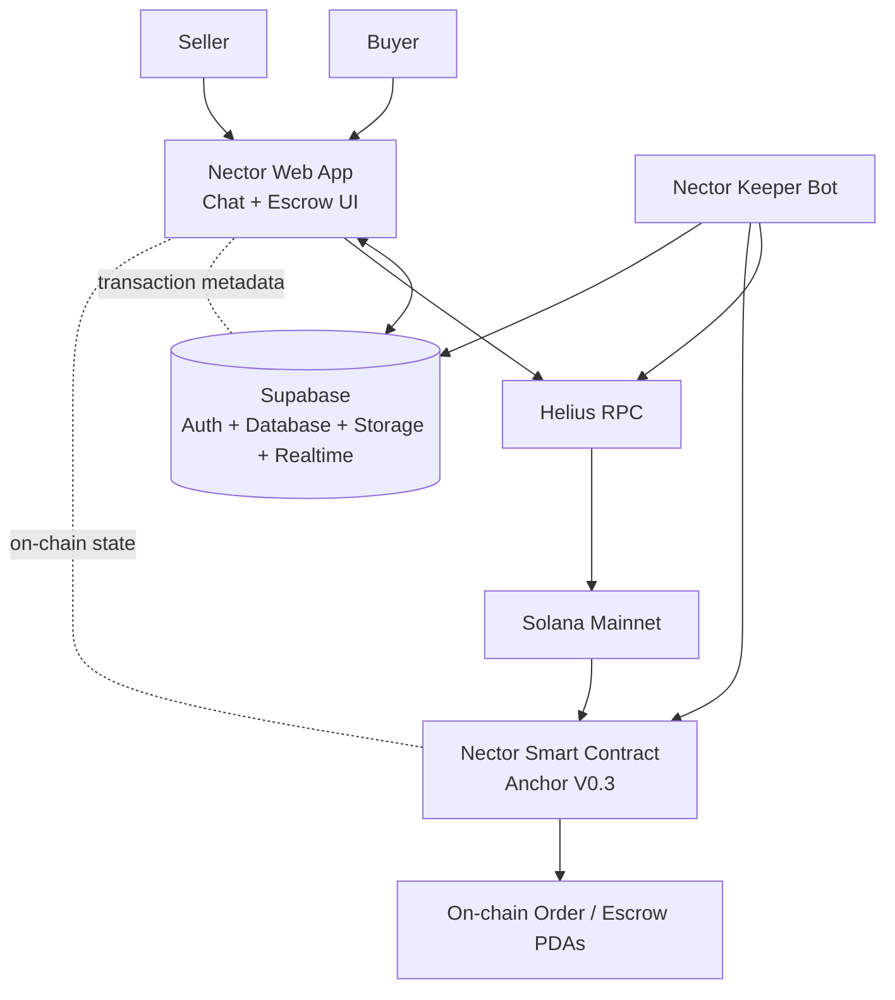

# Nector.chat — System Architecture

## 1. Overview

Nector is a **chat-native, non-custodial escrow platform for P2P transactions**.

The platform allows buyers and sellers to negotiate and create transactions directly inside a chat interface. Instead of relying on a centralized escrow administrator, Nector uses a Solana smart contract to enforce transaction states, escrow fund custody, deadlines, dispute resolution, and economic penalties.

Nector supports:

* Physical products
* Digital products
* NFTs
* On-chain escrow
* Time-based transaction rules
* Automated timeout execution
* Deterministic dispute resolution
* Chat-native transaction management

The core architectural principle is:

> **The application manages the user experience and off-chain metadata, while the Solana program enforces financial state and transaction rules.**

---

## 2. High-Level Architecture



---

## 3. Main Components

| Component             | Responsibility                                                                            |
| --------------------- | ----------------------------------------------------------------------------------------- |
| Nector Web            | Chat interface, wallet interaction, order creation and transaction UI                     |
| Solana Smart Contract | Escrow state machine, fund custody, transaction rules, disputes and penalties             |
| Supabase              | User profiles, usernames, contacts, messages, escrow metadata, files and realtime updates |
| Keeper Bot            | Monitors on-chain orders and triggers timeout instructions                                |
| Helius                | Solana RPC infrastructure                                                                 |
| Solana Mainnet        | Settlement and execution layer                                                            |

---

# 4. User Flow

The normal user journey begins inside the Nector chat interface.

```text
Connect Wallet
      │
      ▼
Choose Username
      │
      ▼
Add Contact
      │
      ▼
Start Conversation
      │
      ▼
Create Order
      │
      ├── Physical Product
      ├── Digital Product
      └── NFT
      │
      ▼
Buyer Funds Escrow
      │
      ▼
Transaction Lifecycle
      │
      ├── Delivery / Shipping
      ├── Confirmation
      ├── Dispute
      └── Timeout
      │
      ▼
Final Settlement
```

Users first connect their wallet, select a username, add another user as a contact, and communicate through chat.

An escrow order is then created directly inside the conversation.

The supported order types are:

* Physical Product
* Digital Product
* NFT

For physical and digital products, the buyer may need to deposit the transaction amount plus a bond. Depending on the product type, the seller may subsequently fund their side of the escrow.

For NFT transactions, the flow differs because the NFT itself is part of the on-chain transaction lifecycle.

---

# 5. Chat-Native Architecture

Nector combines communication and transaction execution into the same interface.

Instead of:

```text
Chat application
      +
Separate escrow application
      +
Separate payment interface
```

Nector provides:

```text
              Nector
                 │
        ┌────────┴────────┐
        │                 │
      Chat              Escrow
        │                 │
        └────────┬────────┘
                 │
          Solana Contract
```

This allows the participants to:

1. Discuss the transaction.
2. Agree on the product.
3. Create the escrow order.
4. Fund the escrow.
5. Deliver or ship the product.
6. Confirm delivery.
7. Open a dispute if necessary.
8. Resolve the transaction according to deterministic protocol rules.

---

# 6. On-Chain vs Off-Chain Architecture

Nector separates blockchain state from application data.

## On-chain

The Solana smart contract is responsible for financial and protocol-critical state.

This includes:

* Escrow funds
* Order state
* Buyer and seller wallets
* Transaction state transitions
* Bonds
* Time-based conditions
* Dispute outcomes
* NFT listing and transfer logic
* Timeout execution

The smart contract is deployed on **Solana Mainnet** using Anchor.

### Program

```text
Program ID:
WytegETAnkDtkeo5H63QvnRPKgK39ez5MSqSBqwydPb

Network:
Solana Mainnet

Framework:
Anchor

Contract Version:
V0.3
```

---

## Off-chain

Supabase stores application-level data required by the Nector interface.

This includes:

* User profiles
* Usernames
* Contacts
* Chat messages
* Escrow order metadata
* Transaction signatures
* Product descriptions
* NFT metadata references
* Delivery files
* Feedback
* Realtime application updates

The database stores references to on-chain objects rather than replacing the smart contract as the source of financial truth.

For example, `escrow_orders` stores the `escrow_pda`, transaction signatures, participants, product type, status and related metadata.

---

# 7. Supabase Architecture

The Supabase database contains the primary application tables:

```text
profiles
   │
   ├── usernames
   │
   └── contacts

messages

escrow_orders

feedbacks
```

The `escrow_orders` table connects the application layer with the blockchain layer.

Important fields include:

```text
escrow_pda
tx_signature
seller_id
buyer_id
seller_wallet
buyer_wallet
type
nft_mint
status
funded_tx
seller_funded_tx
shipped_tx
confirm_tx
refund_tx
dispute_tx
```

This allows the frontend to associate a user-facing escrow order with its corresponding on-chain transaction.

---

# 8. Supabase Security

Row Level Security is enabled on the application tables.

The database uses participant-based access rules.

### Profiles

Authenticated users can create and update their own profile while authenticated users can read profiles.

### Usernames

Users can create and update their own username.

Usernames are globally unique.

### Contacts

A user can manage their own contacts.

### Messages

Messages are restricted to participants.

A user can read a message when they are either:

```text
sender_id = auth.uid()
```

or:

```text
receiver_id = auth.uid()
```

### Escrow Orders

An escrow order can only be inserted by its seller and can be read or updated by the buyer or seller participating in the order.

### Feedback

Authenticated users can submit feedback associated with their own account.

---

# 9. Supabase Storage

Nector uses separate storage buckets for different types of data.

```text
profiles
chat-images
chat-voice
escrow
digital-delivery
```

The buckets have different access controls.

### `profiles`

Public profile images.

### `chat-images`

Private conversation images.

### `chat-voice`

Private voice messages.

### `escrow`

Escrow-related images.

Access is restricted according to the seller and escrow participants.

### `digital-delivery`

Digital product delivery files.

Access is restricted to participants associated with the escrow order.

---

# 10. Realtime Architecture

Supabase Realtime is enabled for:

```text
messages
escrow_orders
```

This allows the chat and escrow interface to react to database changes without requiring the user to manually refresh the application.

The resulting flow is:

```text
Smart Contract
      │
      ▼
Application / Keeper
      │
      ▼
Supabase
      │
      ▼
Realtime
      │
      ▼
Nector UI
```

---

# 11. NFT Architecture

NFT transactions use a dedicated on-chain listing flow.

The smart contract contains dedicated NFT instructions including:

```text
list_nft
buy_nft
cancel_nft_listing
```

as well as the corresponding core NFT instructions:

```text
list_core_nft
buy_core_nft
cancel_core_nft
```

The NFT lifecycle is:

```text
Seller
  │
  ▼
List NFT
  │
  ▼
NFT Listing PDA
  │
  ├──────────────► Buyer buys
  │                    │
  │                    ▼
  │               NFT transferred
  │
  └──────────────► Seller cancels
                       │
                       ▼
                  NFT returned
                       │
                       ▼
                  Listing ends
```

---

# 12. NFT Relisting

A key architectural property of the NFT system is that a previously cancelled or completed NFT listing does not permanently prevent the same NFT mint from being listed again.

At the database level, Nector uses a partial unique index:

```text
seller_id + nft_mint
```

but only for active NFT listings.

The index applies when:

```text
type = 'nft'
AND nft_mint IS NOT NULL
AND status = 'onchain_created'
```

Therefore:

```text
Active listing
     │
     ├── Cancelled
     │      └── no longer blocks relisting
     │
     └── Completed
            └── no longer blocks relisting
```

This allows the same NFT mint to appear in a future listing after the previous listing has ended.

The architecture therefore treats the **listing instance** as separate from the NFT's permanent mint address.

---

# 13. Escrow PDA Architecture

The Keeper and application use the order PDA as the basis for deriving the escrow PDA.

The escrow PDA is derived using:

```text
["escrow", orderPda]
```

with the Nector program ID.

Conceptually:

```text
Order PDA
   │
   ▼
["escrow", orderPda]
   │
   ▼
Escrow PDA
```

This creates a deterministic relationship between an order and its escrow account.

---

# 14. Smart Contract

The current Nector smart contract is implemented with Anchor V0.3.

The contract contains instructions covering:

### NFT

```text
list_nft
buy_nft
cancel_nft_listing
list_core_nft
buy_core_nft
cancel_core_nft
```

### Funding

```text
buyer_fund_escrow
seller_fund_escrow
```

### Delivery

```text
mark_shipped
confirm_delivery
confirm_timeout
```

### Cancellation

```text
buyer_cancel
seller_cancel
```

### Dispute

```text
open_dispute
respond_dispute
buyer_win
refund_buyer
refund_during_discuss
pay_seller_during_discuss
draw
```

### Timeout

```text
shipping_timeout
confirm_timeout
```

The complete instruction source is available under the smart-contract project in the repository.

---

# 15. Transaction State Machine

Nector uses explicit transaction states.

The Supabase representation includes:

```text
onchain_created
BuyerFunded
Shipping
Shipped
Completed
Cancelled
Dispute
Discuss
```

The on-chain program enforces valid state transitions.

Conceptually:

```text
             ┌──────────────┐
             │ On-chain     │
             │ Created      │
             └──────┬───────┘
                    │
                    ▼
             ┌──────────────┐
             │ Buyer        │
             │ Funded       │
             └──────┬───────┘
                    │
                    ▼
             ┌──────────────┐
             │ Shipping     │
             └──────┬───────┘
                    │
                    ▼
             ┌──────────────┐
             │ Shipped      │
             └──────┬───────┘
                    │
          ┌─────────┴─────────┐
          │                   │
          ▼                   ▼
      Completed            Dispute
                              │
                       ┌──────┴──────┐
                       │             │
                       ▼             ▼
                    Discuss       Buyer Win
                       │
                       ├── Refund
                       │
                       └── Draw
```

The exact valid transition is enforced by the smart contract rather than by the frontend.

---

# 16. Dispute Architecture

Nector does not rely on a centralized human moderator to determine the result of a dispute.

Instead, disputes use:

* State transitions
* Time limits
* Bonds
* Deterministic outcomes
* Economic penalties

A dispute can be initiated by the buyer during the review phase.

The seller then has a response window.

The seller can:

1. Refund.
2. Respond and enter discussion.
3. Do nothing.

If the seller does not respond within the required period, the protocol can resolve the dispute according to the buyer-win path.

If the seller responds, both parties enter the discussion phase.

During discussion:

* Buyer can release payment.
* Seller can issue a refund.

If discussion expires without resolution, the result is a draw.

---

# 17. Draw Dispute Mode

Draw Dispute Mode is one of the core economic mechanisms of Nector.

Its purpose is to make both participants explicitly accept financial risk before entering a transaction.

Nector supports two risk modes for physical products:

### Buyer Take Risk — BTR

The buyer takes the greater financial exposure if the dispute reaches a draw.

For product price `P`:

```text
Buyer deposits:
P + 20% of P

Seller deposits:
20% of P
```

### Seller Take Risk — STR

The seller takes the greater financial exposure.

For product price `P`:

```text
Buyer deposits:
P + 20% of P

Seller deposits:
120% of P
```

For digital products, the system defaults to:

```text
BTR
```

If a dispute reaches a draw, the funds locked in escrow are burned according to the protocol rules.

This mechanism is designed to make unresolved disputes economically costly rather than allowing participants to stall indefinitely.

---

# 18. Timeout Architecture

Smart contracts cannot autonomously execute a transaction at a future timestamp.

Therefore Nector uses an external Keeper Bot to monitor deadlines and submit valid timeout transactions.

The important property is that the Keeper does **not** define the outcome.

The smart contract remains responsible for validating whether the timeout is actually valid.

```text
Keeper
   │
   │ monitor
   ▼
On-chain Order
   │
   │ deadline reached?
   ▼
Keeper submits transaction
   │
   ▼
Smart Contract validates deadline
   │
   ├── Invalid → transaction rejected
   │
   └── Valid → state transition executed
```

This means the Keeper is an automation mechanism rather than a trusted authority.

---

# 19. Keeper Bot

The Keeper continuously scans Nector order accounts.

The current implementation:

```text
SCAN_INTERVAL_MS = 10,000
```

which corresponds to a 10-second scan interval.

The Keeper retrieves order accounts and evaluates four timeout conditions:

```text
1. Confirm Timeout
2. Discussion Timeout
3. Respond Timeout
4. Shipping Timeout
```

---

## 19.1 Confirm Timeout

When an order is in the shipped state, the Keeper checks:

```text
markShippedAt + 24 hours
```

If the deadline has passed, it triggers:

```text
confirmTimeout(orderIndex)
```

The resulting application status is updated to:

```text
Completed
```

---

## 19.2 Discussion Timeout

When the seller has responded to a dispute, the Keeper checks:

```text
sellerRespondAt + 24 hours
```

If the deadline has passed, it triggers:

```text
draw(orderIndex)
```

The resulting application status is updated to:

```text
Cancelled
```

---

## 19.3 Respond Timeout

When a dispute is open, the Keeper checks:

```text
openDisputeAt + 24 hours
```

If the seller does not respond in time, the Keeper triggers:

```text
buyerWin(orderIndex)
```

The resulting application status is updated to:

```text
Completed
```

---

## 19.4 Shipping Timeout

When the seller has funded an order, the Keeper calculates:

```text
sellerFundedAt + shippingHours
```

If the shipping deadline has passed, it triggers:

```text
shippingTimeout(orderIndex)
```

The resulting application status is updated to:

```text
Cancelled
```

---

# 20. Keeper and Supabase Synchronization

After successfully triggering an on-chain timeout instruction, the Keeper updates the corresponding Supabase order.

The relationship is:

```text
On-chain Order PDA
       │
       ▼
Keeper
       │
       ├── Execute timeout instruction
       │
       ▼
Transaction Signature
       │
       ▼
Update escrow_orders
       │
       ▼
Insert escrow_update message
       │
       ▼
Supabase Realtime
       │
       ▼
Nector UI
```

This keeps the application state synchronized with the blockchain state.

---

# 21. Keeper Security

The Keeper includes multiple safety checks.

It verifies:

1. The configured RPC URL uses HTTP/HTTPS.
2. Devnet/Testnet RPCs are rejected.
3. The loaded program ID matches the expected Nector Mainnet program.
4. The program account exists.
5. The program account is executable.

The Keeper therefore has explicit safeguards against accidentally connecting to an incorrect network or program.

The Keeper wallet is stored separately from application source code and must never be committed to the repository.

---

# 22. Permissionless Timeout Design

Although Nector operates a Keeper Bot, timeout execution is not conceptually restricted to that single bot.

The smart contract validates the deadline itself.

Therefore:

```text
Nector Keeper
      │
      ├── can trigger
      │
      ▼
Nector Program
      ▲
      │
      ├── Another Keeper
      │
      └── Any valid external transaction
```

This reduces dependence on one specific automation process for protocol correctness.

The Keeper provides automation and liveness, while the smart contract provides enforcement.

---

# 23. Economic Security Model

Nector's security model is based on:

```text
State validation
       +
Time constraints
       +
Economic incentives
```

The protocol does not attempt to determine real-world truth directly.

Instead, it creates financial consequences for actions such as:

* Failing to ship
* Failing to respond
* Delaying disputes
* Forcing unresolved disputes
* Attempting to exploit transaction states

The system is therefore designed around the principle that participants must commit capital and that failure to resolve the transaction can result in financial loss.

---

# 24. Non-Custodial Design

Escrow funds are held by program-derived accounts rather than by a Nector-controlled private key.

Conceptually:

```text
Buyer
  │
  │ funds
  ▼
Escrow PDA
  │
  │ controlled by
  ▼
Nector Program
  │
  ├── valid completion
  ├── valid refund
  ├── valid dispute outcome
  └── valid timeout
```

Nector does not require a centralized administrator to manually release escrow funds.

The smart contract determines when funds can move according to its programmed rules.

---

# 25. RPC Architecture

Nector uses **Helius** as its Solana RPC provider.

The production smart contract and Keeper operate against:

```text
Solana Mainnet
```

The Keeper explicitly verifies that the configured RPC is not Devnet or Testnet before starting.

---

# 26. Fee Model

Nector charges:

```text
1% per transaction
```

The fee model is part of the platform's economic architecture.

---

# 27. Security Boundaries

The architecture intentionally separates responsibilities.

### Frontend

Responsible for:

* User interaction
* Displaying transaction state
* Wallet connection
* Initiating user-authorized transactions

The frontend should not be treated as the source of truth for financial state.

### Supabase

Responsible for:

* Application metadata
* Chat
* User information
* File storage
* Realtime application synchronization

Supabase should not replace the smart contract as the authority for escrow funds.

### Smart Contract

Responsible for:

* Financial state
* Escrow custody
* State transitions
* Deadline validation
* Dispute outcomes
* NFT transaction logic

### Keeper

Responsible for:

* Monitoring deadlines
* Submitting timeout transactions
* Synchronizing resulting application state

The Keeper should not be trusted to determine whether a timeout is valid.

---

# 28. Failure and Attack Considerations

The architecture considers several classes of failure.

## State Transition Attacks

The contract must enforce strict state conditions so that participants cannot skip transaction phases or trigger unauthorized payouts.

## PDA Integrity

Deterministic PDA derivation and Anchor account constraints protect the relationship between orders and escrow accounts.

## Time Manipulation

Time-based logic uses blockchain timestamps.

Small timing differences may exist, but the architecture limits their intended effect to timing rather than allowing arbitrary state transitions.

## Keeper Failure

If the Keeper stops running, timeout transactions may not be submitted immediately.

However, timeout execution remains externally triggerable as long as the transaction satisfies the smart contract's deadline requirements.

## Collusion

The Draw mechanism makes unresolved disputes financially costly for both participants.

---

# 29. Data Flow Example — Normal Transaction

```text
Buyer + Seller
      │
      ▼
Nector Chat
      │
      ▼
Create Escrow Order
      │
      ├──────────────► Supabase
      │                  │
      │                  └── metadata
      │
      ▼
Solana Program
      │
      ▼
Escrow PDA
      │
      ▼
Buyer Funds
      │
      ▼
Seller / Delivery
      │
      ▼
Confirmation
      │
      ▼
Settlement
      │
      ▼
Supabase status update
      │
      ▼
Realtime UI update
```

---

# 30. Data Flow Example — Dispute

```text
Buyer
  │
  ▼
Open Dispute
  │
  ▼
Smart Contract
  │
  ▼
Seller Response Window
  │
  ├──────────────► Refund
  │
  ├──────────────► Respond
  │                    │
  │                    ▼
  │                Discussion
  │                    │
  │                    ├── Buyer releases payment
  │                    │
  │                    ├── Seller refunds
  │                    │
  │                    └── Timeout → Draw
  │
  └──────────────► No response
                       │
                       ▼
                    Buyer Win
```

---

# 31. Repository Architecture

The repository separates the major system components:

```text
nector.chat/
│
├── web/
│   └── Nector/
│       └── Production Web Application
│
├── smart-contract/
│   └── nector/
│       ├── programs/
│       │   └── nector-smart-contract-V0.3/
│       └── tests/
│
├── supabase/
│   └── schema.sql
│
├── keeper/
│   ├── keeper.ts
│   └── idl/
│
└── docs/
    ├── architecture.md
    ├── smart-contract.md
    └── security.md
```

The repository is designed to allow reviewers and developers to inspect the complete architecture:

```text
Frontend
   │
   ├── Smart Contract Client
   │
   ▼
Solana Program
   │
   ├── On-chain state
   └── Escrow PDAs

Frontend
   │
   ▼
Supabase
   │
   ├── Users
   ├── Chat
   ├── Orders
   └── Storage

Keeper
   │
   ├── Solana
   └── Supabase
```

---

# 32. Key Architectural Decisions

## 32.1 Chat-native escrow

Escrow is embedded directly into conversations rather than being a separate workflow.

## 32.2 Non-custodial settlement

Funds are controlled by smart-contract logic rather than a centralized operator.

## 32.3 Deterministic disputes

Disputes are handled through predefined protocol rules instead of centralized human arbitration.

## 32.4 Economic incentives

Participants commit bonds so that inactivity and unresolved disputes can carry financial consequences.

## 32.5 External Keeper

Blockchain timeout logic is activated by an external transaction, while the smart contract remains responsible for validating whether that transaction is allowed.

## 32.6 On-chain / off-chain separation

Financial state remains on-chain while user experience, chat, metadata and file storage are handled off-chain.

## 32.7 NFT listing lifecycle

An NFT mint is not treated as a single permanent listing.

A listing can end and the same NFT can later be listed again, while historical listing records remain distinguishable from the currently active listing.

---

# 33. Core Architecture Principle

The Nector architecture can be summarized as:

```text
                    Nector
                       │
          ┌────────────┴────────────┐
          │                         │
       User UX                 Protocol Layer
          │                         │
       Chat UI                 Solana Program
          │                         │
       Supabase                Escrow PDAs
          │                         │
          └────────────┬────────────┘
                       │
                    Keeper
                       │
                  Timeout
                  Automation
```

The central design principle is:

> **Nector uses the application layer to make escrow simple, while the blockchain layer makes the transaction rules enforceable.**

The result is a chat-native escrow architecture where users interact through a familiar messaging interface while transaction-critical rules are enforced by the Solana smart contract.
